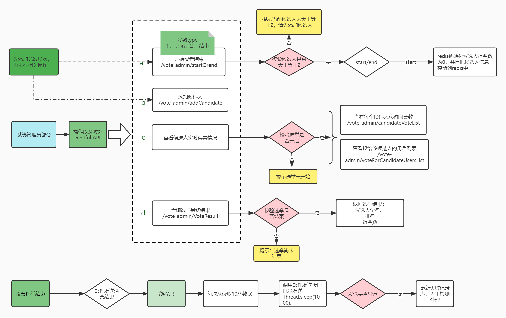
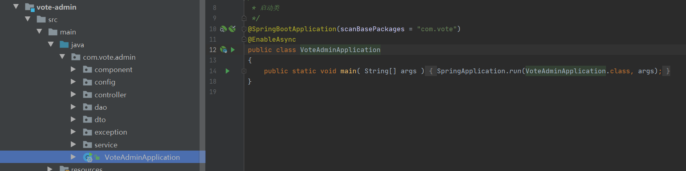
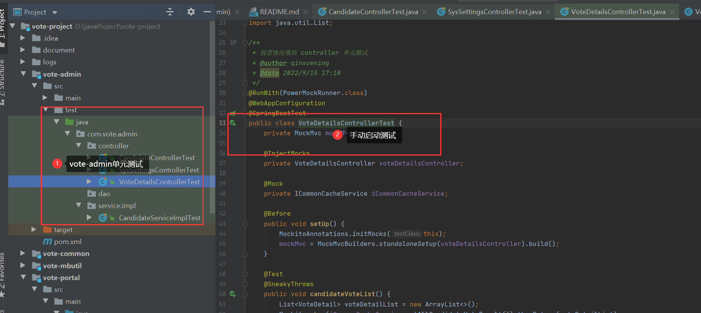
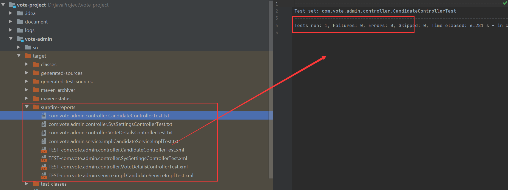

# 简易投票系统
##### 版权归作者所有，未经允许，不可用于商业用途
## 项目结构

``` lua
vote-project
├── vote-admin -- 投票系统管理员服务
├── vote-common -- 工具类及通用代码模块
├── vote-mbutil -- MyBatisPlusGenerator脚手架，生成的数据库操作代码模块
└── vote-portal -- 投票系统用户服务
```

### 投票系统管理员服务流程图


### 投票系统用户服务流程图


### 后端技术选型
| 技术                   | 说明                 | 官网                                                 |
| ---------------------- | -------------------- | ---------------------------------------------------- |
| Spring Boot            | 容器+MVC框架         | https://spring.io/projects/spring-boot               |
| MyBatis-plus           | ORM框架              | https://baomidou.com/                              |
| Mybatis-plus-generator | 数据层代码生成       | https://baomidou.com/                                |
| Knife4j                | 文档生产工具         | https://github.com/xiaoymin/swagger-bootstrap-ui     |
| Mockito                | 单元测试            | https://site.mockito.org/                            |
| PowerMock              | 单元测试框架         | https://github.com/powermock/powermock.git           |
| Redis                  | 分布式缓存           | https://redis.io/                                    |
| Docker                 | 应用容器引擎         | https://www.docker.com/                              |
| Druid                  | 数据库连接池         | https://github.com/alibaba/druid                     |
| MySQL                  | 数据库              | https://www.mysql.com/                               |

## 环境搭建
### 开发环境

| 工具          | 版本号 | 下载                                                         |
| ------------- | ------ | ------------------------------------------------------------ |
| JDK           | 1.8    | https://www.oracle.com/technetwork/java/javase/downloads/jdk8-downloads-2133151.html |
| Mysql         | 5.7    | https://www.mysql.com/                                       |
| Redis         | 5      | https://redis.io/download                                    |
| idea intellij | 2020   | https://www.jetbrains.com/idea/                              |
| maven         | 3.6.3  | https://maven.apache.org/download.cgi                        |

### 搭建步骤
> Linux docker-compose安装（mysql、redis） + 本地开发环境安装jdk1.8、maven3.6.3
- 安装脚本文件在项目目录./document/vote_project_docker-compose，上传到Linux服务器
- linux 安装docker、docker-compose环境
```shell script
yum install -y yum-utils device-mapper-persistent-data lvm2
sudo yum-config-manager --add-repo http://mirrors.aliyun.com/docker-ce/linux/centos/docker-ce.repo
curl -L https://get.daocloud.io/docker/compose/releases/download/1.24.1/docker-compose-`uname -s`-`uname -m` > /usr/local/bin/docker-compose
chmod +x /usr/local/bin/docker-compose
sudo chmod a+x /usr/local/bin/docker-compose #设置权限
```
- docker-compose.yml 运行脚本内容
```yaml
version: '3'
services:
  redis:
    image: redis:5
    container_name: redis
    command: redis-server --appendonly yes
    volumes:
      - ./redis/data:/data #数据文件载
    ports:
      - 6379:6379
  mysql:
    image: mysql:5.7
    container_name: mysql
    command: mysqld --character-set-server=utf8mb4 --collation-server=utf8mb4_unicode_ci
    restart: always
    environment:
      MYSQL_ROOT_PASSWORD: root #设置root帐号密码
    ports:
      - 3306:3306
    volumes:
      - ./mysql/data/db:/var/lib/mysql #数据文件挂载
      - ./mysql/data/conf:/etc/mysql/conf.d #配置文件挂载
      - ./mysql/log:/var/log/mysql #日志文件挂载
```
- 在./document/vote_project_docker-compose目录下执行命令
```shell script
docker-compose up -d
```


### 导入数据库
- 新建数据库，数据库名称为vote
- 数据库文件在当前项目目录下./document/db/vote.sql
- 数据表
```mysql
CREATE TABLE `candidate` (
  `id` int(11) unsigned NOT NULL AUTO_INCREMENT COMMENT '自增id',
  `voting_topic_id` int(11) NOT NULL COMMENT '投票场次id',
  `candidate_full_name` varchar(100) NOT NULL COMMENT '候选人全名',
  `id_number` char(10) NOT NULL COMMENT '候选人身份证号',
  `candidate_nickname` varchar(100) DEFAULT NULL COMMENT '候选人昵称',
  `age` int(3) DEFAULT NULL COMMENT '年龄',
  `gender` tinyint(1) NOT NULL COMMENT '性别(1男，2女)',
  `campaign_slogan` text DEFAULT NULL COMMENT '竞选口号',
  `add_time` datetime DEFAULT NULL COMMENT '添加候选人时间',
  PRIMARY KEY (`id`),
  KEY `voting_topic_id` (`voting_topic_id`)
) ENGINE=InnoDB AUTO_INCREMENT=1 DEFAULT CHARSET=utf8mb4 COMMENT='候选人表';
```
```mysql
CREATE TABLE `vote_details` (
  `id` int(11) unsigned NOT NULL AUTO_INCREMENT COMMENT '自增id',
  `voting_topic_id` int(11) NOT NULL COMMENT '投票场次id',
  `candidate_id` int(11) NOT NULL COMMENT '候选人id',
  `email` varchar(100) NOT NULL COMMENT '投票者邮箱',
  `id_number` char(10) NOT NULL COMMENT '投票者身份证号',
  `vote_time` datetime NOT NULL COMMENT '投票时间',
  PRIMARY KEY (`id`),
  KEY `candidate_id` (`candidate_id`),
  KEY `voting_topic_id` (`voting_topic_id`),
  KEY `id_number` (`id_number`) USING BTREE
) ENGINE=InnoDB AUTO_INCREMENT=1 DEFAULT CHARSET=utf8mb4 COMMENT='投票详情表';
```
```mysql
CREATE TABLE `voting_topic` (
  `id` int(11) unsigned NOT NULL AUTO_INCREMENT COMMENT '自增id',
  `topic_name` varchar(50) NOT NULL COMMENT '场次主题名称',
  `topic_describe` varchar(255) DEFAULT NULL COMMENT '场次主题描述',
  `status` tinyint(1) DEFAULT 0 COMMENT '状态（0未开始，1启用，2关闭），默认0',
  `start_time` datetime DEFAULT NULL COMMENT '投票开始时间',
  `end_time` datetime DEFAULT NULL COMMENT '投票结束时间',
  `create_time` datetime NOT NULL COMMENT '添加场次时间',
  PRIMARY KEY (`id`)
) ENGINE=InnoDB AUTO_INCREMENT=1 DEFAULT CHARSET=utf8mb4 COMMENT='投票主题（场次）表';
```
```mysql
CREATE TABLE `email_send_error` (
  `id` int(11) unsigned NOT NULL AUTO_INCREMENT COMMENT '自增id',
  `voting_topic_id` int(11) DEFAULT NULL COMMENT '投票场次id',
  `response_message` text DEFAULT NULL COMMENT '失败原因',
  `send_email_json` text DEFAULT NULL COMMENT '发送邮箱数据',
  `create_time` datetime DEFAULT NULL COMMENT '发送时间',
  PRIMARY KEY (`id`),
  KEY `voting_topic_id` (`voting_topic_id`)
) ENGINE=InnoDB AUTO_INCREMENT=1 DEFAULT CHARSET=utf8mb4 COMMENT='邮件发送失败记录表';
```


## 项目启动
- 打开idea，安装lombok插件，File->setting->Plugins，搜索lombok安装后重启idea即可
- 项目代码编译


### 投票系统管理员服务
- 在模块vote-admin中修改application-dev.yml配置文件

- 启动项目

- 启动成功，swagger api 文档详情 http://127.0.0.1:8088/doc.html


### 投票系统用户服务
- 在模块vote-portal中修改application-dev.yml配置文件

- 启动项目

- 启动成功，swagger api 文档详情 http://127.0.0.1:8089/doc.html


## 单元测试
### admin单元测试

### portal单元测试


## 项目打包
- maven安装vote-common和vote-mbutil模块

- maven打包vote-admin和vote-portal服务

- 打包完成查看单元自动测试报告是否通过


## 接口返回处理
### 返回状态码和异常状态码
|状态码                    | 备注                        |
| ----------------------- | -------------------------- |
| 200                     |操作成功                         |
| 500                     |操作失败                         |
| 1000                     |添加候选人失败                   |
| 1001                     |添加候选人失败                   |
| 1002                     |该场次候选人已存在，不可重复添加     |
| 1003                     |选举已经开始，不可重复操作            |
| 1004                     |您已经投票过，不可重复投票          |
| 1005                     |选举未开始                       |
| 1006                     |投票失败，请稍后再试！              |
| 1007                     |选举已经结束，无法再投票             |
| 1008                     |该选举场次对应候选人不存在           |
| 1009                     |添加投票场次失败                   |
| 1010                     |该投票场次不存在，请先建选举场次      |
### 异常枚举
```java
package com.vote.common.api;

/**
 * @author qinxuening
 * @date 2022/9/12 17:24
 */
public enum ResultCode implements ErrorCode{
    SUCCESS(200, "操作成功"),
    FAILED(500, "操作失败"),
    VALIDATE_FAILED(1008, "参数检验失败"),
    NOT_FOUND(404, "资源，服务未找到"),
    ELECTION_NOT_START(1005, "选举未开始"),
    ELECTION_NOT_END(1007, "选举已经结束，无法再投票");
    private long code;
    private String message;

    private ResultCode(long code, String message) {
        this.code = code;
        this.message = message;
    }

    @Override
    public long getCode() {
        return code;
    }

    @Override
    public String getMessage() {
        return message;
    }
}
```
### Error Handling 全局异常处理

```java
package com.vote.common.exception;

import com.vote.common.api.CommonResult;
import com.vote.common.api.ResultCode;
import org.springframework.validation.BindException;
import org.springframework.validation.BindingResult;
import org.springframework.validation.FieldError;
import org.springframework.web.bind.MethodArgumentNotValidException;
import org.springframework.web.bind.annotation.ControllerAdvice;
import org.springframework.web.bind.annotation.ExceptionHandler;
import org.springframework.web.bind.annotation.ResponseBody;
import org.springframework.web.servlet.NoHandlerFoundException;

/**
 * 全局异常处理类
 * @author qinxuening
 * @date 2022/9/12 23:11
 */
@ControllerAdvice
public class GlobalExceptionHandler {

    /**
     * 全局异常捕获手动断言异常和基础异常
     * @param e
     * @return
     */
    @ResponseBody
    @ExceptionHandler(value = ApiException.class)
    public CommonResult handleBaseException(ApiException e) {
        if (e.getErrorCode() != null) {
            return CommonResult.failed(e.getErrorCode());
        }
        return CommonResult.failed(e.getMessage());
    }

    /**
     * 全局异常捕获数据校验异常
     * @param e
     * @return
     */
    @ResponseBody
    @ExceptionHandler(value = MethodArgumentNotValidException.class)
    public CommonResult handleArgumentValidException(MethodArgumentNotValidException e) {
        return getCommonResult(e.getBindingResult());
    }

    /**
     * 全局异常捕获参数校验绑定异常处理，比如将@Validated写在方法参数，而不是类上
     * @param e
     * @return
     */
    @ResponseBody
    @ExceptionHandler(value = BindException.class)
    public CommonResult handleBindException(BindException e) {
        return getCommonResult(e.getBindingResult());
    }

    /**
     * 全局异常捕获资源，服务未找到
     * @param e
     * @return
     */
    @ResponseBody
    @ExceptionHandler(value = NoHandlerFoundException.class)
    public CommonResult handleBindException(NoHandlerFoundException e) {
        return CommonResult.failed(ResultCode.NOT_FOUND);
    }

    private CommonResult getCommonResult(BindingResult bindingResult) {
        String message = null;
        if (bindingResult.hasErrors()) {
            FieldError fieldError = bindingResult.getFieldError();
            if (fieldError != null) {
                message = fieldError.getField()+fieldError.getDefaultMessage();
            }
        }
        return CommonResult.validateFailed(message);
    }
}
```

## API文档
### 1、简易投票系统admin服务API
# 候选人模块


# 候选人模块


## 添加候选人


**接口地址**:`/vote-admin/addCandidate`


**请求方式**:`POST`


**请求数据类型**:`application/json`


**响应数据类型**:`*/*`


**接口描述**:


**请求示例**:


```javascript
{
	"age": 0,
	"campaignSlogan": "",
	"candidateFullName": "",
	"candidateNickname": "",
	"gender": 0,
	"idNumber": "",
	"votingTopicId": 0
}
```


**请求参数**:


| 参数名称 | 参数说明 | in    | 是否必须 | 数据类型 | schema |
| -------- | -------- | ----- | -------- | -------- | ------ |
|candidateParam|candidateParam|body|true|添加候选人参数|添加候选人参数|
|&emsp;&emsp;age|年龄||false|integer(int32)||
|&emsp;&emsp;campaignSlogan|竞选口号||false|string||
|&emsp;&emsp;candidateFullName|候选人全名||true|string||
|&emsp;&emsp;candidateNickname|候选人昵称||false|string||
|&emsp;&emsp;gender|性别(1男，2女)||false|integer(int32)||
|&emsp;&emsp;idNumber|候选人身份证号||true|string||
|&emsp;&emsp;votingTopicId|投票场次id||true|integer(int32)||


**响应状态**:


| 状态码 | 说明 | schema |
| -------- | -------- | ----- | 
|200|OK|CommonResult«boolean»|
|201|Created||
|401|Unauthorized||
|403|Forbidden||
|404|Not Found||


**响应参数**:


| 参数名称 | 参数说明 | 类型 | schema |
| -------- | -------- | ----- |----- | 
|code||integer(int64)|integer(int64)|
|data||boolean||
|message||string||


**响应示例**:
```javascript
{
	"code": 0,
	"data": true,
	"message": ""
}
```


# 投票主题（场次）


## 添加投票主题（场次）


**接口地址**:`/vote-admin/addVotingTopic`


**请求方式**:`POST`


**请求数据类型**:`application/json`


**响应数据类型**:`*/*`


**接口描述**:


**请求示例**:


```javascript
{
	"topicDescribe": "",
	"topicName": ""
}
```


**请求参数**:


| 参数名称 | 参数说明 | in    | 是否必须 | 数据类型 | schema |
| -------- | -------- | ----- | -------- | -------- | ------ |
|votingTopicParam|votingTopicParam|body|true|投票场次参数|投票场次参数|
|&emsp;&emsp;topicDescribe|场次主题描述||false|string||
|&emsp;&emsp;topicName|场次主题名称||false|string||


**响应状态**:


| 状态码 | 说明 | schema |
| -------- | -------- | ----- | 
|200|OK|CommonResult«boolean»|
|201|Created||
|401|Unauthorized||
|403|Forbidden||
|404|Not Found||


**响应参数**:


| 参数名称 | 参数说明 | 类型 | schema |
| -------- | -------- | ----- |----- | 
|code||integer(int64)|integer(int64)|
|data||boolean||
|message||string||


**响应示例**:
```javascript
{
	"code": 0,
	"data": true,
	"message": ""
}
```


## 获取所有选举场次


**接口地址**:`/vote-admin/getAllVotingTopicList`


**请求方式**:`GET`


**请求数据类型**:`*`


**响应数据类型**:`*/*`


**接口描述**:


**请求参数**:


暂无


**响应状态**:


| 状态码 | 说明 | schema |
| -------- | -------- | ----- | 
|200|OK|CommonResult«List«VotingTopic对象»»|
|401|Unauthorized||
|403|Forbidden||
|404|Not Found||


**响应参数**:


| 参数名称 | 参数说明 | 类型 | schema |
| -------- | -------- | ----- |----- | 
|code||integer(int64)|integer(int64)|
|data||array|VotingTopic对象|
|&emsp;&emsp;createTime|添加场次时间|string(date-time)||
|&emsp;&emsp;endTime|投票结束时间|string(date-time)||
|&emsp;&emsp;id|自增id|integer(int32)||
|&emsp;&emsp;startTime|投票开始时间|string(date-time)||
|&emsp;&emsp;status|状态（0未开始，1启用，2关闭），默认0|integer(int32)||
|&emsp;&emsp;topicDescribe|场次主题描述|string||
|&emsp;&emsp;topicName|场次主题名称|string||
|message||string||


**响应示例**:
```javascript
{
	"code": 0,
	"data": [
		{
			"createTime": "",
			"endTime": "",
			"id": 0,
			"startTime": "",
			"status": 0,
			"topicDescribe": "",
			"topicName": ""
		}
	],
	"message": ""
}
```


## 设置选举开始或者结束


**接口地址**:`/vote-admin/startOrend/{type}/{votingTopicId}`


**请求方式**:`PUT`


**请求数据类型**:`application/json`


**响应数据类型**:`*/*`


**接口描述**:


**请求参数**:


| 参数名称 | 参数说明 | in    | 是否必须 | 数据类型 | schema |
| -------- | -------- | ----- | -------- | -------- | ------ |
|type|1： 开始；2： 结束|path|true|ref||
|votingTopicId|场次id|path|true|ref||


**响应状态**:


| 状态码 | 说明 | schema |
| -------- | -------- | ----- | 
|200|OK|CommonResult«boolean»|
|201|Created||
|401|Unauthorized||
|403|Forbidden||
|404|Not Found||


**响应参数**:


| 参数名称 | 参数说明 | 类型 | schema |
| -------- | -------- | ----- |----- | 
|code||integer(int64)|integer(int64)|
|data||boolean||
|message||string||


**响应示例**:
```javascript
{
	"code": 0,
	"data": true,
	"message": ""
}
```


# 投票情况模块


## 查询选举最终结果


**接口地址**:`/vote-admin/VoteResult/{votingTopicId}`


**请求方式**:`GET`


**请求数据类型**:`*`


**响应数据类型**:`*/*`


**接口描述**:


**请求参数**:


| 参数名称 | 参数说明 | in    | 是否必须 | 数据类型 | schema |
| -------- | -------- | ----- | -------- | -------- | ------ |
|votingTopicId|投票场次id|path|true|ref||


**响应状态**:


| 状态码 | 说明 | schema |
| -------- | -------- | ----- | 
|200|OK|CommonResult«List«VoteDetail»»|
|401|Unauthorized||
|403|Forbidden||
|404|Not Found||


**响应参数**:


| 参数名称 | 参数说明 | 类型 | schema |
| -------- | -------- | ----- |----- | 
|code||integer(int64)|integer(int64)|
|data||array|VoteDetail|
|&emsp;&emsp;candidateFullName|候选人|string||
|&emsp;&emsp;id|候选人编号|integer(int32)||
|&emsp;&emsp;rank|排名|integer(int32)||
|&emsp;&emsp;votesCount|得票数|integer(int32)||
|&emsp;&emsp;votingTopicId|投票场次|integer(int32)||
|message||string||


**响应示例**:
```javascript
{
	"code": 0,
	"data": [
		{
			"candidateFullName": "",
			"id": 0,
			"rank": 0,
			"votesCount": 0,
			"votingTopicId": 0
		}
	],
	"message": ""
}
```


## 获取实时得票情况


**接口地址**:`/vote-admin/candidateVoteList/{votingTopicId}`


**请求方式**:`GET`


**请求数据类型**:`*`


**响应数据类型**:`*/*`


**接口描述**:


**请求参数**:


| 参数名称 | 参数说明 | in    | 是否必须 | 数据类型 | schema |
| -------- | -------- | ----- | -------- | -------- | ------ |
|votingTopicId|投票场次id|path|true|ref||


**响应状态**:


| 状态码 | 说明 | schema |
| -------- | -------- | ----- | 
|200|OK|CommonResult«List«VoteDetail»»|
|401|Unauthorized||
|403|Forbidden||
|404|Not Found||


**响应参数**:


| 参数名称 | 参数说明 | 类型 | schema |
| -------- | -------- | ----- |----- | 
|code||integer(int64)|integer(int64)|
|data||array|VoteDetail|
|&emsp;&emsp;candidateFullName|候选人|string||
|&emsp;&emsp;id|候选人编号|integer(int32)||
|&emsp;&emsp;rank|排名|integer(int32)||
|&emsp;&emsp;votesCount|得票数|integer(int32)||
|&emsp;&emsp;votingTopicId|投票场次|integer(int32)||
|message||string||


**响应示例**:
```javascript
{
	"code": 0,
	"data": [
		{
			"candidateFullName": "",
			"id": 0,
			"rank": 0,
			"votesCount": 0,
			"votingTopicId": 0
		}
	],
	"message": ""
}
```


## 查看投给该候选人用户列表列表


**接口地址**:`/vote-admin/voteForCandidateUsersList`


**请求方式**:`GET`


**请求数据类型**:`*`


**响应数据类型**:`*/*`


**接口描述**:


**请求参数**:


| 参数名称 | 参数说明 | in    | 是否必须 | 数据类型 | schema |
| -------- | -------- | ----- | -------- | -------- | ------ |
|candidateId|候选人id|query|true|ref||
|pageNum|页码|query|true|ref||
|pageSize|每页大小|query|true|ref||
|votingTopicId|选举场次id|query|true|ref||


**响应状态**:


| 状态码 | 说明 | schema |
| -------- | -------- | ----- | 
|200|OK|CommonResult«CommonPage«VoteDetails对象»»|
|401|Unauthorized||
|403|Forbidden||
|404|Not Found||


**响应参数**:


| 参数名称 | 参数说明 | 类型 | schema |
| -------- | -------- | ----- |----- | 
|code||integer(int64)|integer(int64)|
|data||CommonPage«VoteDetails对象»|CommonPage«VoteDetails对象»|
|&emsp;&emsp;list||array|VoteDetails对象|
|&emsp;&emsp;&emsp;&emsp;candidateId|候选人id|integer(int32)||
|&emsp;&emsp;&emsp;&emsp;email|投票者邮箱|string||
|&emsp;&emsp;&emsp;&emsp;id|自增id|integer(int32)||
|&emsp;&emsp;&emsp;&emsp;idNumber|投票者身份证号|string||
|&emsp;&emsp;&emsp;&emsp;voteTime|投票时间|string(date-time)||
|&emsp;&emsp;&emsp;&emsp;votingTopicId|投票场次id|integer(int32)||
|&emsp;&emsp;pageNum||integer(int32)||
|&emsp;&emsp;pageSize||integer(int32)||
|&emsp;&emsp;total||integer(int64)||
|&emsp;&emsp;totalPage||integer(int32)||
|message||string||


**响应示例**:
```javascript
{
	"code": 0,
	"data": {
		"list": [
			{
				"candidateId": 0,
				"email": "",
				"id": 0,
				"idNumber": "",
				"voteTime": "",
				"votingTopicId": 0
			}
		],
		"pageNum": 0,
		"pageSize": 0,
		"total": 0,
		"totalPage": 0
	},
	"message": ""
}
```

### 2、简易投票系统portal服务API
# 普通用户投票


# 普通用户投票


## 给候选人投票


**接口地址**:`/vote-portal/vote`


**请求方式**:`POST`


**请求数据类型**:`application/json`


**响应数据类型**:`*/*`


**接口描述**:


**请求示例**:


```javascript
{
	"candidateId": 0,
	"email": "",
	"idNumber": "",
	"votingTopicId": 0
}
```


**请求参数**:


| 参数名称 | 参数说明 | in    | 是否必须 | 数据类型 | schema |
| -------- | -------- | ----- | -------- | -------- | ------ |
|voteParam|voteParam|body|true|投票填写参数|投票填写参数|
|&emsp;&emsp;candidateId|候选人id||false|integer(int32)||
|&emsp;&emsp;email|投票者邮箱||false|string||
|&emsp;&emsp;idNumber|投票者身份证号||false|string||
|&emsp;&emsp;votingTopicId|投票场次id||true|integer(int32)||


**响应状态**:


| 状态码 | 说明 | schema |
| -------- | -------- | ----- | 
|200|OK|CommonResult«List«VoteDetail»»|
|201|Created||
|401|Unauthorized||
|403|Forbidden||
|404|Not Found||


**响应参数**:


| 参数名称 | 参数说明 | 类型 | schema |
| -------- | -------- | ----- |----- | 
|code||integer(int64)|integer(int64)|
|data||array|VoteDetail|
|&emsp;&emsp;candidateFullName|候选人|string||
|&emsp;&emsp;id|候选人编号|integer(int32)||
|&emsp;&emsp;rank|排名|integer(int32)||
|&emsp;&emsp;votesCount|得票数|integer(int32)||
|&emsp;&emsp;votingTopicId|投票场次|integer(int32)||
|message||string||


**响应示例**:
```javascript
{
	"code": 0,
	"data": [
		{
			"candidateFullName": "",
			"id": 0,
			"rank": 0,
			"votesCount": 0,
			"votingTopicId": 0
		}
	],
	"message": ""
}
```